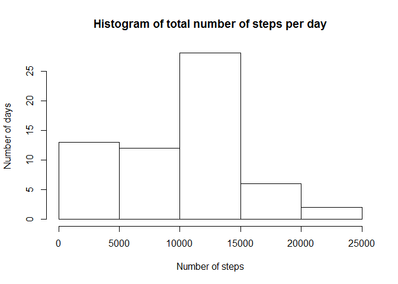
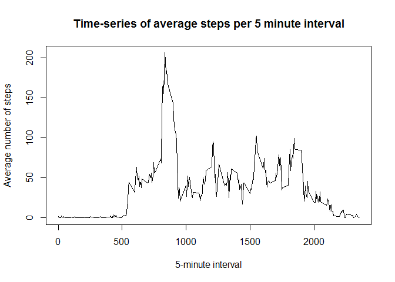
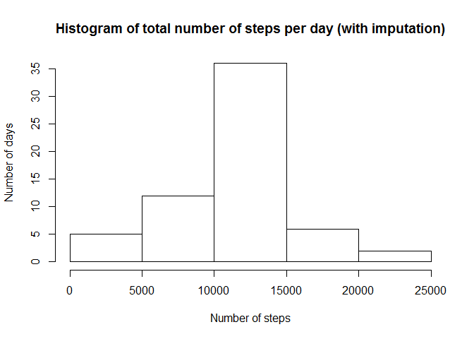
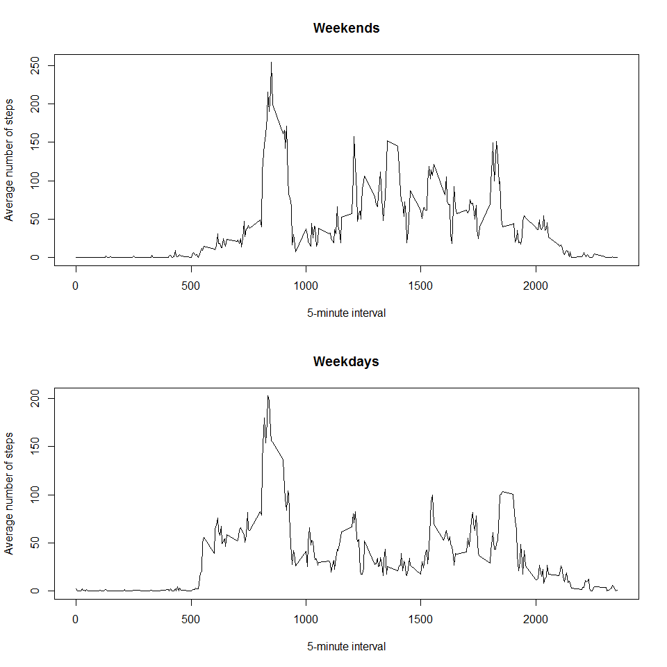

# Reproducible Research: Peer Assessment 1
Genevieve Dupuis  
April 28, 2017  


```r
library(dplyr)
```
## Loading and preprocessing the data

```r
	# Read in raw data, located in working directory (set working directory if necessary)
    wd <- "C:/Coursera/5. Reproducible Research/Week2"
    data <- read.csv(paste0(wd,"/activity.csv"),na.strings = "NA",colClasses = c("numeric","factor","integer"))

	# Set type for "date" as Date (done here to define format)
    data$date <- as.Date(data$date, "%Y-%m-%d")
```
## What is mean total number of steps taken per day?

```r
	# Calculate total steps per day  
    total <- tapply(data$steps,data$date,sum, na.rm = TRUE)
    print(total)
```

```
## 2012-10-01 2012-10-02 2012-10-03 2012-10-04 2012-10-05 2012-10-06 
##          0        126      11352      12116      13294      15420 
## 2012-10-07 2012-10-08 2012-10-09 2012-10-10 2012-10-11 2012-10-12 
##      11015          0      12811       9900      10304      17382 
## 2012-10-13 2012-10-14 2012-10-15 2012-10-16 2012-10-17 2012-10-18 
##      12426      15098      10139      15084      13452      10056 
## 2012-10-19 2012-10-20 2012-10-21 2012-10-22 2012-10-23 2012-10-24 
##      11829      10395       8821      13460       8918       8355 
## 2012-10-25 2012-10-26 2012-10-27 2012-10-28 2012-10-29 2012-10-30 
##       2492       6778      10119      11458       5018       9819 
## 2012-10-31 2012-11-01 2012-11-02 2012-11-03 2012-11-04 2012-11-05 
##      15414          0      10600      10571          0      10439 
## 2012-11-06 2012-11-07 2012-11-08 2012-11-09 2012-11-10 2012-11-11 
##       8334      12883       3219          0          0      12608 
## 2012-11-12 2012-11-13 2012-11-14 2012-11-15 2012-11-16 2012-11-17 
##      10765       7336          0         41       5441      14339 
## 2012-11-18 2012-11-19 2012-11-20 2012-11-21 2012-11-22 2012-11-23 
##      15110       8841       4472      12787      20427      21194 
## 2012-11-24 2012-11-25 2012-11-26 2012-11-27 2012-11-28 2012-11-29 
##      14478      11834      11162      13646      10183       7047 
## 2012-11-30 
##          0
```

```r
	# Make histogram of total steps per day
    hist(total, ylab = "Number of days", xlab = "Number of steps", 
         main = "Histogram of total number of steps per day")
```

<!-- -->

```r
	# Calculate mean number of steps per day (ignoring missing)
		mean <- mean(total[!is.na(total)])
		print(mean)
```

```
## [1] 9354.23
```

```r
	# Calculate median number of steps per day (ignoring missing)
		median <- median(total[!is.na(total)])
		print(median)
```

```
## [1] 10395
```
## What is the average daily activity pattern?

```r
	# Make time-series plot of 5-minute interval vs. average steps taken
		# Calculate mean steps per interval, then plot
		interv <- tapply(data$steps,data$interval,mean, na.rm = TRUE)
		plot(names(interv),interv, type = "l", xlab = "5-minute interval", ylab = "Average number of steps", 
		     main = "Time-series of average steps per 5 minute interval")
```

<!-- -->

```r
	# Determine which five-minute interval has max average steps 
		interv_max <- max(interv)
		print(names(interv[interv == interv_max]))
```

```
## [1] "835"
```
## Imputing missing values

```r
	# Calculate total number of missing values
		sum(is.na(data))
```

```
## [1] 2304
```
### Strategy for imputation: Create new dataset that includes the mean of the 5-minute interval for all days assigned to any missing values

```r
    # Create data set that contains values for imputing (mean value per 5-minute interval)
    impute <- cbind(interval = names(interv),mean = interv)
    # for each row in data set
    for (i in 1:dim(data)[1]) { 		
      # if steps is missing (there are no missings in date or interval)
      if ( is.na(data[i,1]) ) { 		
        # set interval for missing observation
        NAint <- data$interval[i]		
        # assign second column of impute (mean for that interval) to the missing value
        data[i,1] <- as.numeric(impute[which(impute[,1] == NAint),2]) 
      }		
    }
	
	# Make histogram of imputed data, calculate mean/median
		# Histogram
		total_imp <- tapply(data$steps,data$date,sum)
		hist(total_imp, ylab = "Number of days", xlab = "Number of steps", 
		     main = "Histogram of total number of steps per day (with imputation)")
```

<!-- -->

```r
		# Calculate mean number of steps per day (with imputed data)
		mean_imp <- mean(total_imp)
		print(mean_imp)
```

```
## [1] 10766.19
```

```r
		# Calculate median number of steps per day (with imputed data) 
		median_imp <- median(total_imp)
		print(median_imp)
```

```
## [1] 10766.19
```

## Are there differences in activity patterns between weekdays and weekends?

```r
	# Add column to data set with weekday/weekend ( 0 = weekday, 1 = weekend )
		data <- mutate(data,day = weekdays(date), daygroup = as.integer(day %in% c("Friday","Saturday")))
		data$daygroup[data$daygroup == "1"] <- "weekend"
		data$daygroup[data$daygroup == "0"] <- "weekday"
	
	# Make time-series plot comparing weekend and weekday
		# Make data set for weekend and weekday, apply mean per 5-minute interval
		data_we <- filter(data,daygroup == "weekend")
		data_wd <- filter(data,daygroup == "weekday")
		interv_we <- tapply(data_we$steps,data_we$interval,mean)
		interv_wd <- tapply(data_wd$steps,data_wd$interval,mean)
```

```r
		# Plot the two data sets!
		par(mfrow=c(2,1))
		plot(names(interv_we),interv_we, type = "l", xlab = "5-minute interval", 
		     ylab = "Average number of steps", main = "Weekends")
		plot(names(interv_wd),interv_wd, type = "l", xlab = "5-minute interval", 
		     ylab = "Average number of steps", main = "Weekdays")
```

<!-- -->


